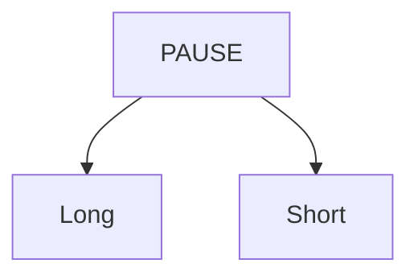
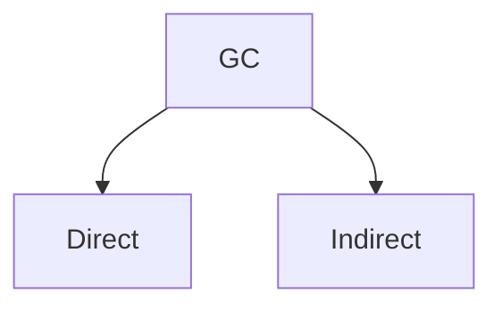

# Garbage Collection

Metrics when choosing a Garbage Collector
1. Throughput
2. Stability
3. Space Overhead
4. Scalability
5. Completeness
6. Space time
7. Language Overhead

----
1. **Safety**: a collector must never reclaim a `live object` that is still in use. Not all garbage collectors are safe.

2. **Throughput**: The amount of time spent collecting garbage relative to the amount of time spent executing user code should be **very low**. This is
widespread among the *stop-the-world* collectors.

a. Short Pause: ensures there are cycles for application execution  
b. Long Pause: handles defragmentation and compaction of the heap.

3. **Completeness**: all garbage collectors must reclaim all unreachable objects, eventually. If this property is not found in your GC it will lead to memory leaks.

4. **Pause Time**: The amount of time spent collecting garbage relative to the amount of time spent executing user code should be **very low**. This is
very common among the *stop-the-world* collectors. GC needs to do `defragmentation` and `compaction` of the heap.

5. **Space Overhead**: GC needs to track the structures to delete and when to delete, these info is stored in a data structure called `mark bitmap`, which will need a portion of memory. This is because the GC needs to keep track of which objects are live and which are dead, and this information is stored in the mark bitmap. How much of memory is my GC using? Examples of structures GC used it `BitMap Tables`, `Graphs`, and `mark bitmap`.

6. **Language Specific Optimization**: GC needs to be optimized for the language it is used in. For example, in Go, the GC is optimized for concurrent execution and has a built-in mechanism for detecting and handling cycles. Most GC exploits the language's features (memory management, garbage collection, and concurrency) to optimize the cleaning process.

7. **Scalability**: GC needs to use modern hardware capabilities to scale efficiently.

## GC Algorithms
There are 2 categories of garbage collectors:
1. Direct Collectors
2. Indirect Collectors

1. **Mark & Sweep**
- mark
- sweep
- mutator and collector threads
  - mutator -> for application
  - collector -> for GC

# Resources
1. [Go's Garbage Collection](https://golang.org/doc/gc)
2. [Arpit Bhayani Garbage Collection Youtube](https://www.youtube.com/watch?v=IojMqbegejk&list=PLsdq-3Z1EPT3MvruOP09U1bWmcjxLIMwR&index=0)
3. [Cornell University](https://www.cs.cornell.edu/courses/cs3110/2012sp/lectures/lec26-gc/lec26.html)
4. [Go Garbage Collector Codebase](https://github.com/golang/go/blob/master/src/runtime/mgc.go)
5. [Understanding Allocations](https://www.youtube.com/watch?v=ZMZpH4yT7M0)
6. [Dynamic Memory Allocations in C](https://www.youtube.com/watch?v=xDVC3wKjS64)
7. [Zero Allocation Parser in C](https://www.codeproject.com/articles/Zero-Dynamic-Allocation-JSON-Parser-in-C#comments-section)
8. [Go garbage collector](https://tip.golang.org/doc/gc-guide)
9. [Reddit Go Garbage Collector](https://www.reddit.com/r/golang/comments/17i8tof/where_can_i_learn_in_depth_about_golang_garbage/)
10. [Zero Allocation JSON lexer in GO](https://www.reddit.com/r/golang/comments/jbmsx3/ann_fast_json_lexer_with_zero_heap_allocations/)
11. [Zero Dependency GC](https://github.com/mkirchner/gc?tab=readme-ov-file#data-structures)
12. [GC - example](https://github.com/venkat1017/Garbage-Collector/tree/main)
